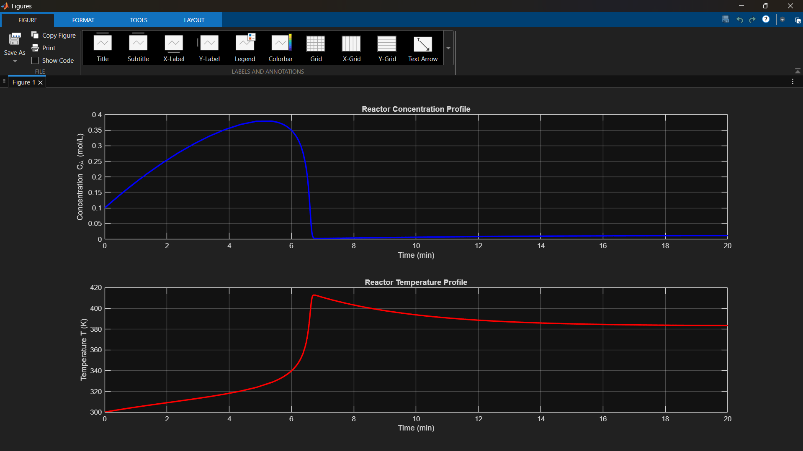

# CSTR Dynamic Simulation & Control

## 📌 Project Overview
This project simulates the dynamic behavior of a **Non-Isothermal Continuous Stirred Tank Reactor (CSTR)** experiencing an exothermic reaction ($A \rightarrow B$). 

The simulation models thermal runaway scenarios and demonstrates process control strategies using **MATLAB** (ODE45 solver) and **Simulink**.

## 🛠️ Tech Stack
* **MATLAB:** Numerical solution of coupled Mass & Energy balance differential equations.
* **Simulink:** Block-diagram modeling of feedback loops.
* **Process Control:** Analysis of reactor stability and response to disturbances.

## 📊 Results
The simulation tracks **Concentration ($C_A$)** and **Temperature ($T$)** over time, visualizing the system's transition from startup to steady state.

*(Figure: Dynamic response of Reactor Temperature and Concentration over 20 minutes)*

## 🧮 Mathematical Model
The system is governed by the following coupled ODEs:

**1. Mass Balance:**
$$\frac{dC_A}{dt} = \frac{F}{V}(C_{A_{in}} - C_A) - k_0 e^{\frac{-E}{RT}} C_A$$

**2. Energy Balance:**
$$\frac{dT}{dt} = \frac{F}{V}(T_{in} - T) + \frac{-\Delta H}{\rho C_p} k_0 e^{\frac{-E}{RT}} C_A - \frac{UA}{V \rho C_p}(T - T_{cool})$$
